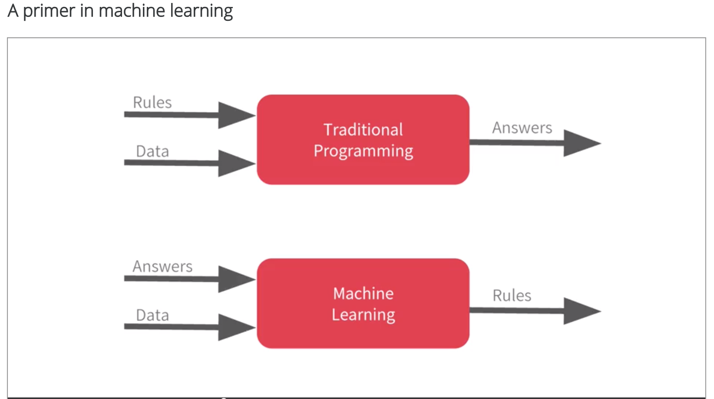

# Machine Learning - Coursera Week 1
#MachineLearning/DeepLearning/TensorFlow/Coursera/Week1#

## Week 1
Paradigm difference from traditional programming:
Deep Learning is a branch of ML, which discovers the pattern from a set of data.



Our application is to program higher level behavior. 

Hello World example:
**Define a Model**

`model = keras.Sequential([keras.layers.Dense(units=1, input_shape=[1])])`
	- We have aModel, which has a series of layers, which will be described in Sequential.
	- The layer will be described by Dense function.  The output dimension is 1 (units=1), and input _shape is [1]; this is in tensor format. 
		- [What is a tensor in TensorFlow? - Quora](https://www.quora.com/What-is-a-tensor-in-TensorFlow)		
		- [What the Hell is “Tensor” in “TensorFlow”? – Hacker Noon](https://hackernoon.com/what-the-hell-is-tensor-in-tensorflow-e40dbf0253ee)
```
A rank/dimension zero tensor or a Scalar.
  5        											# The shape is []

A rank/dimension 1 tensor or a Vector.
  [ 1., 2., 3., 4. ]     								# The shape is [4]

A rank/dimension 2 tensor or a Matrix.  
  [ [ 1., 2., 3., 4. ], [ 5., 6., 7., 8. ] ]. 		# Matrix of shape [ 2, 4 ]

A rank/dimension 3 tensor or a Tensor. This is 3D, just like real world with X, Y and Z axis. Simply, it is just matrices inside a bigger matrix.
[ [ [ 1., 2., 3., 4. ] ], [ [ 5., 6., 7., 8. ] ] ]  	# Tensor of shape [ 2, 1, 4 ]
														# two matrix with 1 row x 4 column
```

More … [tf.keras.layers.Dense  |  TensorFlow](https://www.tensorflow.org/api_docs/python/tf/keras/layers/Dense) , [Sequential - Keras Documentation](https://keras.io/models/sequential/)
We can [Use the Keras Functional API for Deep Learning](https://machinelearningmastery.com/keras-functional-api-deep-learning/) model.

```
 model.compile(optimizer='sgd', loss='mean_squared_error')
```

`compile` configures the model for training. 
sgd is the name of instance of optimizer, SGD.  We can define/instantiate one optimizer or just use default value as above.
More … [Optimizers - Keras Documentation](https://keras.io/optimizers/), [Losses - Keras Documentation](https://keras.io/losses/)

Training: 
	- assume a rule, 
	- use test data to evaluate the accuracy/loss,
	- use optimizer to figure out the next guess per loss function; we picked number of trials and other stuff  ahead of time.

**Prepare Data**
```
xs = np.array([-1.0, 0.0, 1.0, 2.0, 3.0, 4.0], dtype=float)
ys = np.array([-3.0, -1.0, 1.0, 3.0, 5.0, 7.0], dtype=float)
```

**Train Model**
```
model.fit(xs, ys, epochs=500)
```
Keras uses `fit` function to train the model for a fixed number of epochs (iterations on a dataset)
More … [Guide to the Sequential model - Keras Documentation](https://keras.io/getting-started/sequential-model-guide/), [Model (functional API) - Keras Documentation](https://faroit.github.io/keras-docs/1.1.0/models/model/)

**Use Model**
```
print(model.predict([10.0]))
```

Save notebook as ‘tf-intro-Exercise 1 - House Prices - Question.ipynb’ !!

	 
## More …
[The Keras 4 Step Workflow](https://www.kdnuggets.com/2018/06/keras-4-step-workflow.html) week 1 walks thru these steps.
[7 Steps to Mastering Deep Learning with Keras](https://www.kdnuggets.com/2017/10/seven-steps-deep-learning-keras.html) expanded learning.

[Machine Learning Algorithms In Layman’s Terms, Part 1](https://towardsdatascience.com/machine-learning-algorithms-in-laymans-terms-part-1-d0368d769a7b)

#MachineLearning/DeepLearning/TensorFlow